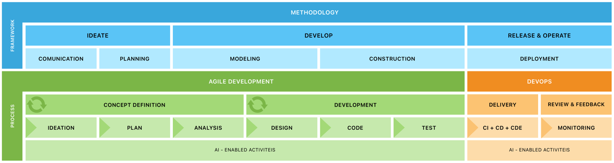

# 🧠 SPREAD — *Smart Process for Reengineering and Evolution using AI in Decoupled Domains*

## 📌 Visão Geral

**SPREAD** é um framework de engenharia de software voltado à construção, reengenharia e evolução de sistemas distribuídos, com ênfase em **domínios desacoplados**, **microsserviços** e na **aplicação prática de Inteligência Artificial (IA)** para apoiar atividades ao longo do ciclo de vida do software.



O framework está estruturado em três camadas:

- **Framework** — Abstração metodológica em fases (Ideate, Develop, Release & Operate)
- **Processo** — Práticas integradas de desenvolvimento ágil e DevOps
- **AI-Enabled Activities** — Atividades assistidas por LLMs e outras técnicas de IA (transversal)

## 🚀 Contexto
Este framework é resultado direto de uma pesquisa aplicada a um grande banco brasileiro, mais especificamente à área de investimentos, que enfrenta desafios constantes relacionados à manutenção de regras tributárias implementadas em sistemas legados (mainframe). A partir desse cenário real, foi conduzido um experimento com base na proposta do SPREAD para reengenharia de domínios, com foco na extração e modularização de regras de negócio via motor de cálculo desacoplado. O caso fornece dados empíricos sobre como a incorporação de IA pode transformar atividades centrais do processo de software — como análise de requisitos, planejamento, design e refatoração — tornando-as mais eficientes, rastreáveis e adaptativas às mudanças do negócio.

## 🎯 Objetivos

- Promover **decisões conscientes sobre granularidade de serviços**
- Aumentar a **modularidade e modificabilidade** dos sistemas
- Reduzir a complexidade arquitetural e de manutenção
- Aplicar **IA generativa e analítica** para automatizar artefatos e diagnósticos


## 🧰 Aplicações de IA por Etapa

| Etapa                                                         | Atividade Principal                                      | Aplicações de IA                                                                                           |
|---------------------------------------------------------------|----------------------------------------------------------|-------------------------------------------------------------------------------------------------------------|
| [**Ideation**](docs/process/1-concept/a-ideation/ideation.md) | - Benchmarking de soluções <br> - Roteiros de entrevista <br> - Geração de documento de contexto | - LLMs para busca automatizada de tendências e tecnologias <br> - Geração de prompts e roteiros personalizados <br> - Criação assistida de documentos de contexto usando contexto regulatório e técnico |
| [**Plan**](docs/process/1-concept/b-plan/plan.md)             | - Definição de escopo inicial <br> - Estimativas e cronograma <br> - Mapeamento de riscos        | - LLMs para geração automática de planos a partir de documentos prévios <br> - Apoio na alocação de recursos e definição de entregas <br> - Avaliação de riscos com base em histórico e contexto similar |
| [**Analysis**](docs/process/1-concept/c-analysis/analysis.md) | - Elaboração de DRS e backlog <br> - Análise de processos existentes                             | - Extração de requisitos funcionais e não-funcionais com LLMs <br> - Análise semiautomática de regras de negócio e legados <br> - Geração de user stories e priorização com IA |
| [**Design**](docs/process/2-development/a-design/design.md)   | - Arquitetura de software (C4) <br> - Modelagem de dados <br> - Análise de trade-offs            | - Geração de diagramas C4 (sistema, containers, componentes) com base em DRS/backlog <br> - Criação de modelos ER <br> - Avaliação automatizada de atributos de qualidade (ATAM) |


## 📂 Estrutura da Documentação

A estrutura dos diretórios reflete as fases e artefatos do processo:

```
docs/
└── process/
    ├── 1-concept/
    │   ├── ideation/
    │   ├── plan/
    │   └── analysis/
    └── 2-development/
        └── design/
```

Cada subpasta contém arquivos `.md` com:

- Artefatos gerados com auxílio de IA
- Prompts utilizados
- Templates e documentos finais
- Anexos referenciais (normas, links, etc.)

---

## 🧪 Extensibilidade e Pesquisa

O SPREAD é orientado por pesquisas científica sobre:

- **Modularidade arquitetural**
- **Modificabilidade de software**
- **Manutenibilidade e acoplamento**

Os experimentos são conduzidos com base em sistemas reais utilizados na indústria.

---

## 📎 Recursos

- 🔗 [Site do projeto SPReaD na ASERG](https://aserg.labsoft.dcc.ufmg.br/project/spread/)
- 🔗 [SPReaD: Service-Oriented Process for Reengineering and DevOps](https://aserg.org/publication/dasilva-sp-rea-d-serviceoriented-process-2021/)
- 📄 Documentação técnica por fase (ver pasta `docs/process/`)
- 🧠 Base de prompts e templates para automação assistida por IA

---

## 👨‍🔬 Autor

Desenvolvido por Yan, especialista em engenharia de software, pesquisador doutorando na área de granularidade de microsserviços, 
com base em estudos e casos reais da indústria bancária brasileira.

---
