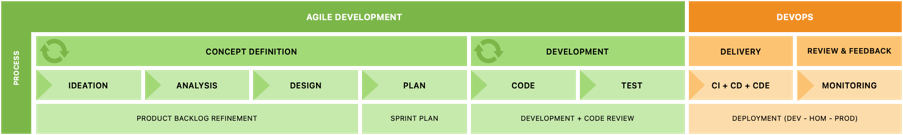
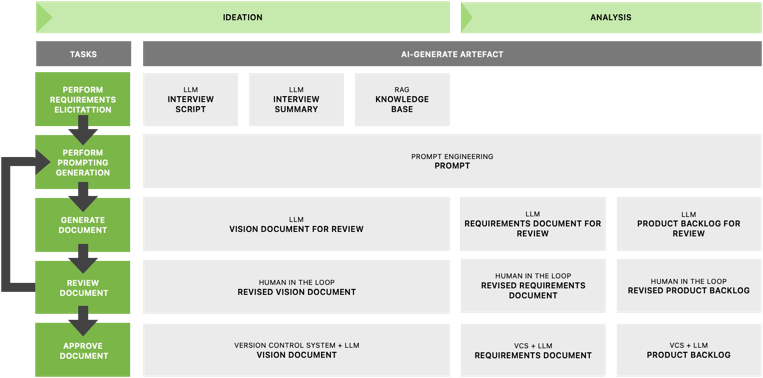

# 🚀 Assessment de Onboarding - Motor de Cálculo de Regras Tributárias

## 📋 Informações do Projeto
- **Nome:** Motor de Cálculo de Regras Tributárias
- **Versão:** 1.0
- **Data de Criação:** 28 de junho de 2025
- **Objetivo:** Sistema centralizado para gerenciamento e execução de regras tributárias

---

## 👥 1. DEFINIÇÃO DE PESSOAS E PAPÉIS

### 1.1 Estrutura Organizacional
| Papel | Responsabilidades | Competências Necessárias | Quantidade |
|-------|------------------|-------------------------|------------|
| **Product Owner** | • Definição de prioridades • Validação de entregas • Comunicação com stakeholders | • Conhecimento de regras tributárias • Gestão de produto • Comunicação | 1 |
| **Scrum Master** | • Facilitação de cerimônias • Remoção de impedimentos • Coaching da equipe | • Metodologias ágeis • Facilitação • Resolução de conflitos | 1 |
| **Tech Lead** | • Arquitetura técnica • Code review • Decisões técnicas • Mentoria | • C#/.NET • AWS • Arquitetura de sistemas • Liderança técnica | 1 |
| **Desenvolvedor Backend** | • Desenvolvimento de APIs • Integração com mainframe • Testes unitários | • C#/.NET • APIs REST • Testes automatizados • Integração de sistemas | 3-4 |
| **DevOps Engineer** | • Infraestrutura AWS • CI/CD • Monitoramento • Segurança | • AWS • Docker/Kubernetes • CI/CD • Monitoramento | 1 |
| **Analista de Negócio** | • Elicitação de requisitos • Modelagem de regras • Validação com usuários | • Análise de negócio • Regras tributárias • Documentação • Comunicação | 1-2 |
| **QA Engineer** | • Testes de integração • Testes de regressão • Automação de testes | • Testes automatizados • Ferramentas de teste • Análise de qualidade | 1 |

### 1.2 Stakeholders Externos
| Stakeholder | Papel | Envolvimento |
|-------------|-------|--------------|
| **Equipe de Operações** | Usuários finais | Alto - Validação e feedback |
| **Área Jurídica** | Validação regulatória | Médio - Aprovação de regras |
| **Segurança da Informação** | Compliance | Médio - Validação de segurança |
| **Infraestrutura** | Suporte técnico | Baixo - Provisionamento |

---

## 🛠️ 2. FERRAMENTAS E TECNOLOGIAS

### 2.1 Stack Tecnológica
| Categoria | Tecnologia | Justificativa |
|-----------|------------|---------------|
| **Backend** | C#/.NET Core | Compatibilidade com AWS, performance |
| **Banco de Dados** | PostgreSQL (AWS RDS) | ACID, escalabilidade |
| **Infraestrutura** | AWS | Escalabilidade, serviços gerenciados |
| **Containerização** | Docker + ECS | Portabilidade, escalabilidade |
| **CI/CD** | GitHub Actions | Integração com repositório |
| **Monitoramento** | CloudWatch + DataDog | Observabilidade completa |

### 2.2 Ferramentas de Desenvolvimento
| Ferramenta      | Propósito | Configuração |
|-----------------|-----------|--------------|
| **GitHub**      | Versionamento | Repositório privado |
| **IU Click**    | Gestão de projetos | Quadro Scrum |
| **Share point** | Documentação | Wiki do projeto |
| **Teams**       | Comunicação | Canais por área |
| **LeanIX**      | Design | Protótipos e UI |
| **Insominia**   | Testes de API | Coleções de teste |
| **SonarQube**   | Qualidade de código | Análise estática |

### 2.3 Ferramentas de Teste
| Ferramenta | Tipo de Teste | Configuração |
|------------|---------------|--------------|
| **xUnit** | Testes unitários | Cobertura > 80% |
| **JMeter** | Testes de performance | Carga e stress |
| **Postman** | Testes de API | Validação de contratos |

---

## 🔄 3. MODELO DE TRABALHO

### 3.1 Metodologia
- **Framework:** Scrum
- **Sprint Duration:** 15 dias
- **Daily Standup:** 15 min, 9:00 AM
- **Sprint Planning:** 4 horas
- **Sprint Review:** 2 horas
- **Sprint Retrospective:** 1 hora

### 3.2 Fluxo de Desenvolvimento

#### 3.2.1 Ciclo de Vida do refinamento

<small>*Em progresso</small>

### 3.3 Definição de Pronto (DoD)
- [ ] História de usuário implementada
- [ ] Critérios de aceitação atendidos
- [ ] Código desenvolvido e revisado
- [ ] Testes unitários implementados (cobertura > 80%)
- [ ] Testes de integração passando
- [ ] Documentação atualizada
- [ ] Code review aprovado
- [ ] Deploy em ambiente de QA
- [ ] Métricas de avaliação coletadas
- [ ] Aprovação do Product Owner

### 3.4 Definição de Pronto (DoR)
- [ ] História de usuário escrita
- [ ] Critério de aceitação definido
- [ ] Estimativa de esforço realizada
- [ ] Dependências identificadas
- [ ] Critérios de teste definidos
- [ ] Critérios de performance definidos (se aplicável)
- [ ] Métricas de avaliação definidas

---

## 📅 4. CERIMÔNIAS E EVENTOS

### 4.1 Cerimônias Scrum
| Cerimônia | Frequência       | Duração | Participantes | Objetivo |
|-----------|------------------|---------|---------------|----------|
| **Sprint Planning** | A cada 15 dias   | 4h      | Equipe completa | Planejamento do sprint |
| **Daily Standup** | Diário           | 15min   | Equipe de desenvolvimento | Sincronização |
| **Sprint Review** | A cada 2 semanas | 2h      | Equipe + Stakeholders | Demonstração |
| **Sprint Retrospective** | A cada 2 semanas | 1h      | Equipe completa | Melhoria contínua |
| **Backlog Refinement** | Semanal          | 2h      | PO + Tech Lead + Devs | Refinamento de histórias |

### 4.2 Eventos Específicos do Projeto
| Evento | Frequência | Duração | Participantes | Objetivo |
|--------|------------|---------|---------------|----------|
| **Architecture Review** | Quinzenal | 2h | Tech Lead + Devs | Revisão de arquitetura |
| **Security Review** | Mensal | 2h | Security Team + Devs | Validação de segurança |
| **Performance Review** | Mensal | 2h | DevOps + Devs | Análise de performance |

### 4.3 Comunicação
| Canal         | Frequência | Participantes | Propósito |
|---------------|------------|---------------|-----------|
| **Teams**     | Contínuo | Equipe completa | Comunicação geral |
| **Teams #pr** | Contínuo | Desenvolvedores | Discussões técnicas |
| **Email**     | Conforme necessário | Stakeholders | Comunicação formal |

---

## 📦 5. ENTREGÁVEIS

### 5.1 Entregáveis por Sprint
| Entregável                | Frequência | Responsável               | Critérios de Aceitação                |
|---------------------------|------------|---------------------------|---------------------------------------|
| **Incremento Funcional**  | A cada sprint | Equipe de desenvolvimento | Funcionalidades testadas e aprovadas  |
| **Documentação Técnica**  | A cada sprint | Tech Lead                 | Arquitetura e APIs documentadas       |
| **Testes Automatizados**  | A cada sprint | QA + Devs                 | Cobertura e qualidade definidas       |
| **Relatório de Processo** | A cada sprint | SPEC + Tríade             | Métricas qualitativas + quantitativas |

### 5.2 Entregáveis por Fase
| Fase | Entregáveis                                                                                    | Critérios de Conclusão |
|------|------------------------------------------------------------------------------------------------|----------------------|
| **Fase 1 - MVP** | • Integração SIDE • API REST • Interface simples • Integração com 1 sistema           | • Funcionalidades core implementadas • Testes passando • Deploy em produção |
| **Fase 2 - Evolução** | • Interface de funcionalidades • Integração com 2+ sistemas                                 | • Usabilidade validada • Performance otimizada • Segurança validada |
| **Fase 3 - Escalabilidade** | • Monitoramento avançado • Auto-scaling • Integração completa • Documentação completa | • Sistema estável em produção • Métricas de sucesso atingidas • Treinamento da equipe de operações |

### 5.3 Documentação Obrigatória
| Documento | Responsável | Frequência de Atualização |
|-----------|-------------|-------------------------|
| **Arquitetura do Sistema** | Tech Lead | A cada mudança significativa |
| **API Documentation** | Desenvolvedores | A cada nova API |
| **User Manual** | Analista de Negócio | A cada nova funcionalidade |
| **Deployment Guide** | DevOps | A cada mudança de infraestrutura |
| **Security Guidelines** | Security Team | Anual |
| **Business Rules Catalog** | Analista de Negócio | A cada nova regra |

---

## 📊 6. MÉTRICAS E KPIs

### 6.1 Métricas de Desenvolvimento
| Métrica | Meta | Frequência de Medição |
|---------|------|---------------------|
| **Velocity** | Consistente | A cada sprint |
| **Sprint Burndown** | On-track | Diário |
| **Code Coverage** | > 80% | A cada sprint |
| **Bug Rate** | < 5% | A cada sprint |
| **Lead Time** | < 5 dias | Semanal |
| **Cycle Time** | < 3 dias | Semanal |

### 6.2 Métricas de Qualidade
| Métrica | Meta | Frequência de Medição |
|---------|------|---------------------|
| **Defect Density** | < 1 bug/100 LOC | A cada sprint |
| **Technical Debt** | < 10% | Mensal |
| **Security Vulnerabilities** | 0 críticas | Semanal |
| **Performance** | < 200ms response time | Semanal |
| **Availability** | > 99.9% | Diário |

### 6.3 Métricas de Negócio
| Métrica | Meta | Frequência de Medição |
|---------|------|---------------------|
| **Time to Market** | Redução de 50% | Mensal |
| **User Satisfaction** | > 4.5/5 | Mensal |
| **Adoption Rate** | > 80% | Mensal |
| **Business Value Delivered** | Aumento de 30% | Trimestral |

---

## 🎯 7. PLANO DE ONBOARDING

### 7.1 - Introdução
| Item  | Atividade | Responsável | Objetivo |
|-------|-----------|-------------|----------|
| **1** | Apresentação do projeto | Product Owner | Contexto e visão |
| **2** | Setup de ambiente | DevOps | Ferramentas e acesso |
| **3** | Arquitetura técnica | Tech Lead | Visão técnica |
| **4** | Regras de negócio | Analista de Negócio | Domínio |
| **5** | Primeira cerimônia | Scrum Master | Processo |

### 7.2 - Imersão
| Item  | Atividade | Responsável | Objetivo |
|-------|-----------|-------------|----------|
| **1** | Pair programming | Tech Lead | Conhecimento técnico |
| **2** | Shadowing | Analista de Negócio | Entendimento do domínio |
| **3** | Primeira história | Mentor | Aplicação prática |

### 7.3 - Produção
| Atividade | Responsável | Objetivo |
|-----------|-------------|----------|
| **Histórias independentes** | Membro da equipe | Autonomia |
| **Code reviews** | Tech Lead | Qualidade |
| **Feedback contínuo** | Scrum Master | Desenvolvimento |

---

## ⚠️ 8. RISCOS E MITIGAÇÕES

### 8.1 Riscos de Pessoas
| Risco | Probabilidade | Impacto | Mitigação |
|-------|---------------|---------|-----------|
| **Rotatividade alta** | Média | Alto | Plano de sucessão, documentação |
| **Conhecimento concentrado** | Alta | Alto | Pair programming, documentação |
| **Resistência à mudança** | Média | Médio | Comunicação, treinamento |

### 8.2 Riscos Técnicos
| Risco | Probabilidade | Impacto | Mitigação |
|-------|---------------|---------|-----------|
| **Integração com mainframe** | Alta | Alto | POC, especialistas |
| **Performance** | Média | Alto | Testes de carga |
| **Segurança** | Média | Alto | Security review |

### 8.3 Riscos de Processo
| Risco | Probabilidade | Impacto | Mitigação |
|-------|---------------|---------|-----------|
| **Scope creep** | Alta | Médio | Backlog refinement |
| **Estimativas imprecisas** | Média | Médio | Planning poker |
| **Dependências externas** | Alta | Alto | Mapeamento de stakeholders |

---

## 📞 9. CONTATOS E ESCALAÇÃO

### 9.1 Matriz de Escalação
| Situação | Primeiro Contato | Escalação | Ação |
|----------|------------------|-----------|------|
| **Impedimento técnico** | Tech Lead | Product Owner | Resolução em 24h |
| **Conflito de equipe** | Scrum Master | HR | Mediação |
| **Mudança de escopo** | Product Owner | Stakeholders | Aprovação |
| **Problema de segurança** | Security Team | CISO | Investigação |

### 9.2 Contatos Importantes
| Papel | Nome | Email | Telefone |
|-------|------|-------|----------|
| **Product Owner** | [Nome] | [email] | [telefone] |
| **Scrum Master** | [Nome] | [email] | [telefone] |
| **Tech Lead** | [Nome] | [email] | [telefone] |
| **DevOps** | [Nome] | [email] | [telefone] |

---

## 📝 10. CHECKLIST DE IMPLEMENTAÇÃO

### 10.1 Preparação (Semana 0)
- [ ] Equipe contratada
- [ ] Ferramentas configuradas
- [ ] Ambiente preparado
- [ ] Documentação inicial criada
- [ ] Stakeholders identificados

### 10.2 Execução (Sprint 1)
- [ ] Primeira sprint planning realizada
- [ ] Daily standups iniciados
- [ ] Primeiras histórias em desenvolvimento
- [ ] Processo de code review estabelecido
- [ ] Métricas iniciais coletadas

### 10.3 Consolidação (Sprint 2-3)
- [ ] Processo estabilizado
- [ ] Velocity consistente
- [ ] Qualidade mantida
- [ ] Feedback positivo
- [ ] Próximos sprints planejados

---

**Documento criado em:** 28 de junho de 2025  
**Próxima revisão:** 15 de julho de 2025  
**Responsável pela manutenção:** Scrum Master 
