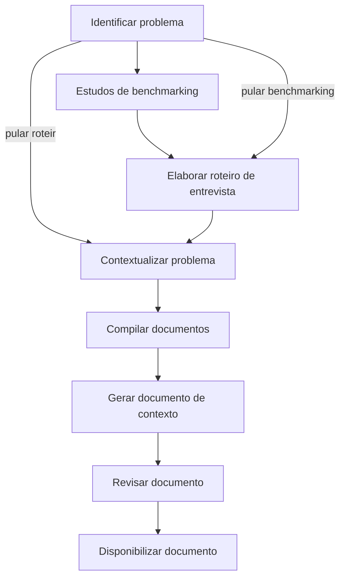

# 💡 Protocolo de Adoção de LLMs – Fase: Ideation
Etapa responsável pela geração da ideia inicial do projeto, partindo de uma necessidade, oportunidade de mercado, dor do usuário ou visão estratégica. É neste momento que se define o propósito central do produto, buscando responder perguntas como: Por que este projeto deve existir? e Que valor ele entrega para seus usuários ou para o negócio? Durante a ideação, são exploradas diferentes soluções possíveis e seus impactos, com o objetivo de alinhar todos os envolvidos quanto à direção e aos benefícios esperados. A fase pode incluir atividades as listadas a seguir.

## 🎯 Objetivo
Utilizar LLMs para descoberta e documentação da ideia inicial, com foco na compreensão contextual, redução de esforço manual e aumento da qualidade e abrangência das informações levantadas.

## 📘 Atividades e Interações com LLMs

| Atividade                          | Papel da LLM                                                        | Artefato(s)                            | Avaliação Qualitativa                                                  | Avaliação Quantitativa                        |
|------------------------------------|---------------------------------------------------------------------|----------------------------------------|------------------------------------------------------------------------|------------------------------------------------|
| Identificar problema               | -                                                                   | Descrição geral do problema            | Clareza e objetividade da definição inicial                           | Tempo médio de finalização                   |
| Estudos de benchmarking            | Buscar referências relevantes, categorizar problemas                | Documento com referências `(prompt A)` | Aderência dos tópicos ao domínio do problema                         | Nº de referências válidas; tempo de extração |
| Elaborar roteiro de entrevista     | Sugerir perguntas com base no contexto `(prompt B)`                 | Roteiro da entrevista                  | Cobertura das categorias exigidas                                      | Nº de perguntas úteis aprovadas              |
| Contextualizar problema            | —                                                                   | Documentos iniciais                    | Completude das descrições e abrangência dos elementos                 | Tempo médio de consolidação                  |
| Compilar documentos                | Suporte à organização e estruturação de conteúdo                    | Base de conhecimento e RAG             | Coesão e estrutura lógica dos documentos                               | Tempo de compilação                          |
| Gerar documento de contexto        | Montagem do documento `(prompt C)`                                  | Documento de contexto em Markdown      | Aderência ao template e clareza narrativa                              | Nº de edições pós-geração; tempo de geração  |
| Revisar documento                  | (eventualmente uso de LLM para correção linguística ou refinamento) | —                                      | Coerência, clareza textual                                             | Tempo de revisão                             |
| Disponibilizar documento           | —                                                                   | Documento final publicado              | Conformidade com versão esperada e padrões de formatação              | Tempo até entrega                            |

## 🧠 Exemplos de Aplicações com LLMs

- **LLMs (ChatGPT ou Gemini)**:
  - Buscar e sumarizar referências com base em critérios (prompt A)
  - Gerar perguntas para stakeholders segmentadas por categoria (prompt B)
  - Elaborar documento de contexto com base em dados (prompt C)

## 📊 Indicadores para Monitoramento

### Qualitativos
- Aderência aos objetivos do artefato
- Clareza textual e consistência entre seções
- Grau de aceitação das sugestões do LLM pelos especialistas

### Quantitativos
- Tempo médio para geração de cada artefato
- Taxa de sugestões aceitas por LLM
- Nº de revisões necessárias
- Nº de tópicos cobertos vs. esperados

## 📂 Artefatos Modelos

- [Estudos de benchmarking e tendênciasdo](./artifact/ideation-reseach.md)
- [Roteiro de entrevista](./artifact/ideation-questions.md)
- [Documento de contexto](./artifact/ideation-context.md)

## 🔗 Prompts

- [Prompt A – Benchmarking e Tendências](./prompts.md)
- [Prompt B – Roteiro de Entrevista](./prompts.md)
- [Prompt C – Documento de Contexto](./prompts.md)

## 🛠️ Instrumentação Recomendada

- Registro de prompts e outputs
- Log das interações com LLMs (aceitação/rejeição de sugestões)
- Controle de versão dos artefatos (ex: Git)
- Registro de tempo por atividade (ex: Toggl)

