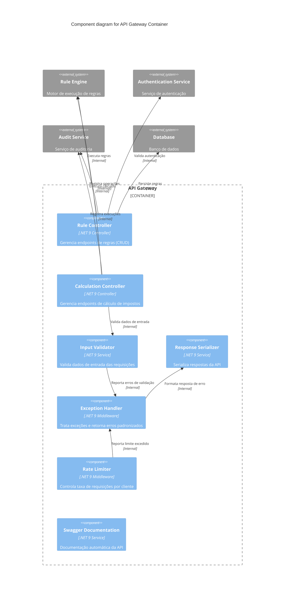
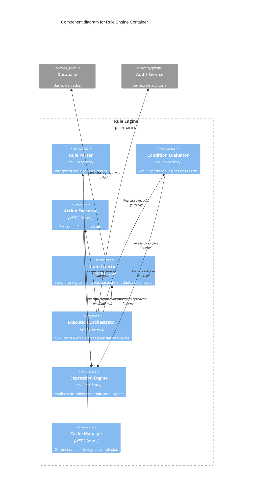

# 🏗️ C4 Model - Component Diagram

## 📋 Descrição
Diagrama de componentes que detalha a estrutura interna do container API Gateway, mostrando os principais componentes e suas responsabilidades.

---

## 🎯 Component Diagram - PlantUML (API Gateway)

```plantuml
@startuml C4_Component_API
!include https://raw.githubusercontent.com/plantuml-stdlib/C4-PlantUML/master/C4_Component.puml

LAYOUT_WITH_LEGEND()

title Component diagram for API Gateway Container

Container_Boundary(api, "API Gateway") {
    Component(controller, "Rule Controller", ".NET 9 Controller", "Gerencia endpoints de regras (CRUD)")
    
    Component(calc_controller, "Calculation Controller", ".NET 9 Controller", "Gerencia endpoints de cálculo de impostos")
    
    Component(validator, "Input Validator", ".NET 9 Service", "Valida dados de entrada das requisições")
    
    Component(serializer, "Response Serializer", ".NET 9 Service", "Serializa respostas da API")
    
    Component(exception_handler, "Exception Handler", ".NET 9 Middleware", "Trata exceções e retorna erros padronizados")
    
    Component(rate_limiter, "Rate Limiter", ".NET 9 Middleware", "Controla taxa de requisições por cliente")
    
    Component(swagger, "Swagger Documentation", ".NET 9 Service", "Documentação automática da API")
}

System_Ext(engine, "Rule Engine", "Motor de execução de regras")
System_Ext(auth, "Authentication Service", "Serviço de autenticação")
System_Ext(audit, "Audit Service", "Serviço de auditoria")
System_Ext(db, "Database", "Banco de dados")

Rel(controller, engine, "Executa regras", "Internal")
Rel(controller, auth, "Valida autenticação", "Internal")
Rel(controller, audit, "Registra operações", "Internal")
Rel(controller, db, "Persiste regras", "SQL")

Rel(calc_controller, engine, "Executa cálculos", "Internal")
Rel(calc_controller, validator, "Valida dados de entrada", "Internal")
Rel(calc_controller, audit, "Registra execuções", "Internal")

Rel(validator, exception_handler, "Reporta erros de validação", "Internal")
Rel(exception_handler, serializer, "Formata resposta de erro", "Internal")

Rel(rate_limiter, exception_handler, "Reporta limite excedido", "Internal")

@enduml
```

---

## 🎯 Component Diagram - Mermaid.js (API Gateway)



---

## 🎯 Component Diagram - PlantUML (Rule Engine)

```plantuml
@startuml C4_Component_Engine
!include https://raw.githubusercontent.com/plantuml-stdlib/C4-PlantUML/master/C4_Component.puml

LAYOUT_WITH_LEGEND()

title Component diagram for Rule Engine Container

Container_Boundary(engine, "Rule Engine") {
    Component(rule_parser, "Rule Parser", ".NET 9 Service", "Interpreta definições de regras")
    
    Component(condition_evaluator, "Condition Evaluator", ".NET 9 Service", "Avalia condições lógicas das regras")
    
    Component(action_executor, "Action Executor", ".NET 9 Service", "Executa ações de cálculo")
    
    Component(rule_selector, "Rule Selector", ".NET 9 Service", "Seleciona regras aplicáveis baseado em dados de entrada")
    
    Component(execution_orchestrator, "Execution Orchestrator", ".NET 9 Service", "Orquestra a execução sequencial das regras")
    
    Component(expression_engine, "Expression Engine", ".NET 9 Library", "Avalia expressões matemáticas e lógicas")
    
    Component(cache_manager, "Cache Manager", ".NET 9 Service", "Gerencia cache de regras compiladas")
}

System_Ext(db, "Database", "Banco de dados")
System_Ext(audit, "Audit Service", "Serviço de auditoria")

Rel(rule_selector, db, "Consulta regras ativas", "SQL")
Rel(rule_parser, expression_engine, "Compila expressões", "Internal")
Rel(condition_evaluator, expression_engine, "Avalia condições", "Internal")
Rel(action_executor, expression_engine, "Executa cálculos", "Internal")
Rel(execution_orchestrator, rule_selector, "Solicita regras aplicáveis", "Internal")
Rel(execution_orchestrator, condition_evaluator, "Avalia condições", "Internal")
Rel(execution_orchestrator, action_executor, "Executa ações", "Internal")
Rel(execution_orchestrator, audit, "Registra execução", "Internal")
Rel(cache_manager, rule_parser, "Cache de regras compiladas", "Internal")

@enduml
```

---

## 🎯 Component Diagram - Mermaid.js (Rule Engine)



---

## 📝 Componentes e Responsabilidades

### 🔌 API Gateway Components

#### Rule Controller
- **Responsabilidades**:
  - Endpoints CRUD para regras (`GET`, `POST`, `PUT`, `DELETE`)
  - Gerenciamento de versões de regras
  - Ativação/desativação de regras
  - Listagem e filtros de regras

#### Calculation Controller
- **Responsabilidades**:
  - Endpoint de cálculo de impostos (`POST /calculate`)
  - Validação de dados de entrada
  - Orquestração da execução de regras
  - Retorno de resultados formatados

#### Input Validator
- **Responsabilidades**:
  - Validação de schemas de entrada
  - Verificação de tipos de dados
  - Validação de regras de negócio
  - Geração de mensagens de erro claras

#### Response Serializer
- **Responsabilidades**:
  - Formatação padronizada de respostas
  - Serialização JSON/XML
  - Tratamento de diferentes formatos de saída
  - Headers de resposta apropriados

#### Exception Handler
- **Responsabilidades**:
  - Captura de exceções não tratadas
  - Formatação de erros HTTP apropriados
  - Logging de erros para debugging
  - Respostas de erro consistentes

#### Rate Limiter
- **Responsabilidades**:
  - Controle de taxa de requisições por cliente
  - Proteção contra abuso da API
  - Headers de rate limiting
  - Configuração de limites por endpoint

#### Swagger Documentation
- **Responsabilidades**:
  - Documentação automática da API
  - Interface interativa para testes
  - Especificação OpenAPI
  - Exemplos de uso

### ⚙️ Rule Engine Components

#### Rule Parser
- **Responsabilidades**:
  - Interpretação de definições de regras
  - Compilação de expressões
  - Validação de sintaxe
  - Cache de regras compiladas

#### Condition Evaluator
- **Responsabilidades**:
  - Avaliação de condições lógicas
  - Interpretação de expressões booleanas
  - Aplicação de operadores lógicos
  - Contexto de dados de entrada

#### Action Executor
- **Responsabilidades**:
  - Execução de ações de cálculo
  - Interpretação de expressões aritméticas
  - Aplicação de fórmulas matemáticas
  - Acumulação de resultados

#### Rule Selector
- **Responsabilidades**:
  - Seleção de regras aplicáveis
  - Filtros por tipo de investimento
  - Ordenação por precedência
  - Cache de regras ativas

#### Execution Orchestrator
- **Responsabilidades**:
  - Orquestração da execução sequencial
  - Controle de fluxo de execução
  - Agregação de resultados
  - Tratamento de exceções

#### Expression Engine
- **Responsabilidades**:
  - Avaliação de expressões matemáticas
  - Interpretação de funções customizadas
  - Validação de tipos de dados
  - Otimização de performance

#### Cache Manager
- **Responsabilidades**:
  - Cache de regras compiladas
  - Invalidação de cache
  - Estratégias de cache
  - Monitoramento de performance

---

## 🔗 Fluxos de Execução

### 1. Criação de Regra
1. Rule Controller recebe requisição
2. Input Validator valida dados
3. Rule Parser compila a regra
4. Dados são persistidos no Database
5. Audit Service registra operação

### 2. Execução de Cálculo
1. Calculation Controller recebe dados
2. Input Validator valida entrada
3. Rule Selector busca regras aplicáveis
4. Execution Orchestrator executa sequencialmente
5. Action Executor calcula resultados
6. Response Serializer formata resposta

---

## 🎯 Benefícios da Arquitetura de Componentes

1. **Separação de Responsabilidades**: Cada componente tem uma função específica
2. **Testabilidade**: Componentes podem ser testados isoladamente
3. **Reutilização**: Componentes podem ser reutilizados em diferentes contextos
4. **Manutenibilidade**: Mudanças em um componente não afetam outros
5. **Performance**: Cache e otimizações específicas por componente 