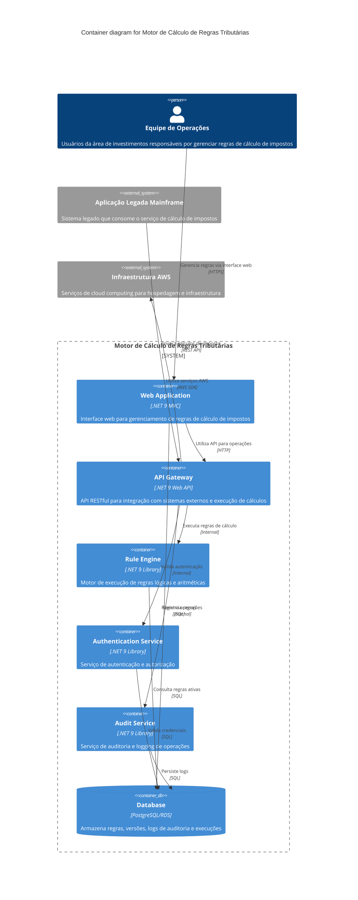

# 🏗️ C4 Model - Container Diagram

## 📋 Descrição
Diagrama de containers que mostra a arquitetura interna do Motor de Cálculo de Regras Tributárias, detalhando os principais componentes e suas responsabilidades.

---

## 🎯 Container Diagram - PlantUML

```plantuml
@startuml C4_Container
!include https://raw.githubusercontent.com/plantuml-stdlib/C4-PlantUML/master/C4_Container.puml

LAYOUT_WITH_LEGEND()

title Container diagram for Motor de Cálculo de Regras Tributárias

Person(operacoes, "Equipe de Operações", "Usuários da área de investimentos responsáveis por gerenciar regras de cálculo de impostos")

System_Boundary(c1, "Motor de Cálculo de Regras Tributárias") {
    Container(webapp, "Web Application", ".NET 9 MVC", "Interface web para gerenciamento de regras de cálculo de impostos")
    
    Container(api, "API Gateway", ".NET 9 Web API", "API RESTful para integração com sistemas externos e execução de cálculos")
    
    Container(engine, "Rule Engine", ".NET 9 Library", "Motor de execução de regras lógicas e aritméticas")
    
    Container(auth, "Authentication Service", ".NET 9 Library", "Serviço de autenticação e autorização")
    
    Container(audit, "Audit Service", ".NET 9 Library", "Serviço de auditoria e logging de operações")
    
    ContainerDb(db, "Database", "PostgreSQL/RDS", "Armazena regras, versões, logs de auditoria e execuções")
}

System_Ext(mainframe, "Aplicação Legada Mainframe", "Sistema legado que consome o serviço de cálculo de impostos")

System_Ext(aws, "Infraestrutura AWS", "Serviços de cloud computing para hospedagem e infraestrutura")

Rel(operacoes, webapp, "Gerencia regras via interface web", "HTTPS")
Rel(mainframe, api, "Invoca cálculos de imposto", "REST API")
Rel(webapp, api, "Utiliza API para operações", "HTTP")
Rel(api, engine, "Executa regras de cálculo", "Internal")
Rel(api, auth, "Valida autenticação", "Internal")
Rel(api, audit, "Registra operações", "Internal")
Rel(engine, db, "Consulta regras ativas", "SQL")
Rel(auth, db, "Valida credenciais", "SQL")
Rel(audit, db, "Persiste logs", "SQL")
Rel(webapp, db, "Gerencia regras", "SQL")
Rel(api, aws, "Utiliza serviços AWS", "AWS SDK")

@enduml
```

---

## 🎯 Container Diagram - Mermaid.js



---

## 📝 Containers e Responsabilidades

### 🌐 Web Application
- **Tecnologia**: .NET 9 MVC
- **Responsabilidades**:
  - Interface web para gerenciamento de regras
  - Formulários de criação/edição de regras
  - Visualização de histórico e logs
  - Controle de ativação/desativação

### 🔌 API Gateway
- **Tecnologia**: .NET 9 Web API
- **Responsabilidades**:
  - Endpoints RESTful para integração externa
  - Execução de cálculos de impostos
  - Validação de dados de entrada
  - Orquestração de serviços internos

### ⚙️ Rule Engine
- **Tecnologia**: .NET 9 Library
- **Responsabilidades**:
  - Interpretação e execução de regras lógicas
  - Avaliação de condições e ações
  - Cálculos aritméticos complexos
  - Ordenação e precedência de regras

### 🔐 Authentication Service
- **Tecnologia**: .NET 9 Library
- **Responsabilidades**:
  - Autenticação de usuários
  - Controle de acesso e autorização
  - Gestão de sessões
  - Integração com sistemas de identidade

### 📊 Audit Service
- **Tecnologia**: .NET 9 Library
- **Responsabilidades**:
  - Logging de todas as operações
  - Rastreabilidade de alterações
  - Geração de relatórios de auditoria
  - Versionamento de regras

### 🗄️ Database
- **Tecnologia**: PostgreSQL/RDS
- **Responsabilidades**:
  - Persistência de regras e versões
  - Armazenamento de logs de auditoria
  - Histórico de execuções
  - Configurações do sistema

---

## 🔗 Fluxos Principais

### 1. Gerenciamento de Regras
1. Usuário acessa Web Application
2. Web Application interage com API Gateway
3. API Gateway valida autenticação
4. Operações são registradas no Audit Service
5. Dados são persistidos no Database

### 2. Execução de Cálculos
1. Sistema externo invoca API Gateway
2. API Gateway valida dados de entrada
3. Rule Engine executa regras ativas
4. Resultado é retornado via API
5. Execução é registrada no Audit Service

---

## 🎯 Benefícios da Arquitetura

1. **Modularidade**: Cada container tem responsabilidades bem definidas
2. **Escalabilidade**: Containers podem ser escalados independentemente
3. **Manutenibilidade**: Mudanças em um container não afetam outros
4. **Testabilidade**: Cada container pode ser testado isoladamente
5. **Segurança**: Autenticação centralizada e auditoria completa 