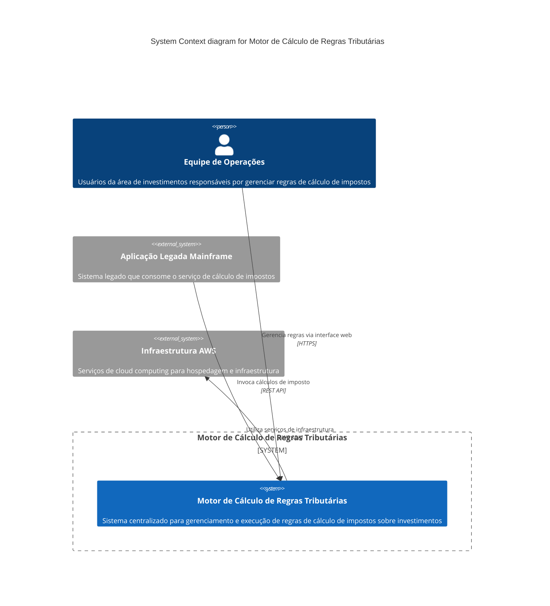

# 🏗️ C4 Model - System Context Diagram

## 📋 Descrição
Diagrama de contexto do sistema que mostra o Motor de Cálculo de Regras Tributárias e suas interações com usuários e sistemas externos.

---

## 🎯 System Context Diagram - PlantUML

```plantuml
@startuml C4_Context
!include https://raw.githubusercontent.com/plantuml-stdlib/C4-PlantUML/master/C4_Context.puml

LAYOUT_WITH_LEGEND()

title System Context diagram for Motor de Cálculo de Regras Tributárias

Person(operacoes, "Equipe de Operações", "Usuários da área de investimentos responsáveis por gerenciar regras de cálculo de impostos")

System_Boundary(c1, "Motor de Cálculo de Regras Tributárias") {
    System(motor, "Motor de Cálculo de Regras Tributárias", "Sistema centralizado para gerenciamento e execução de regras de cálculo de impostos sobre investimentos")
}

System_Ext(mainframe, "Aplicação Legada Mainframe", "Sistema legado que consome o serviço de cálculo de impostos")

System_Ext(aws, "Infraestrutura AWS", "Serviços de cloud computing para hospedagem e infraestrutura")

Rel(operacoes, motor, "Gerencia regras via interface web", "HTTPS")
Rel(mainframe, motor, "Invoca cálculos de imposto", "REST API")
Rel(motor, aws, "Utiliza serviços de infraestrutura", "AWS SDK")

@enduml
```

---

## 🎯 System Context Diagram - Mermaid.js



---

## 📝 Elementos do Diagrama

### 👥 Usuários
- **Equipe de Operações**: Usuários primários que gerenciam as regras de cálculo através da interface web

### 🏢 Sistemas Externos
- **Aplicação Legada Mainframe**: Sistema cliente que consome o serviço de cálculo de impostos
- **Infraestrutura AWS**: Plataforma de cloud computing que hospeda o sistema

### 🔧 Sistema Principal
- **Motor de Cálculo de Regras Tributárias**: Sistema central que gerencia e executa as regras de cálculo

### 🔗 Relacionamentos
- Interface web para gerenciamento de regras
- API REST para integração com sistemas legados
- Utilização de serviços AWS para infraestrutura

---

## 🎯 Objetivos do Sistema

1. **Desacoplamento**: Separar regras de negócio das aplicações legadas
2. **Agilidade**: Permitir mudanças rápidas nas regras sem intervenção de TI
3. **Reutilização**: Compartilhar regras entre diferentes contextos do banco
4. **Auditoria**: Rastrear todas as alterações nas regras
5. **Performance**: Processar cálculos com baixa latência (< 50ms) 