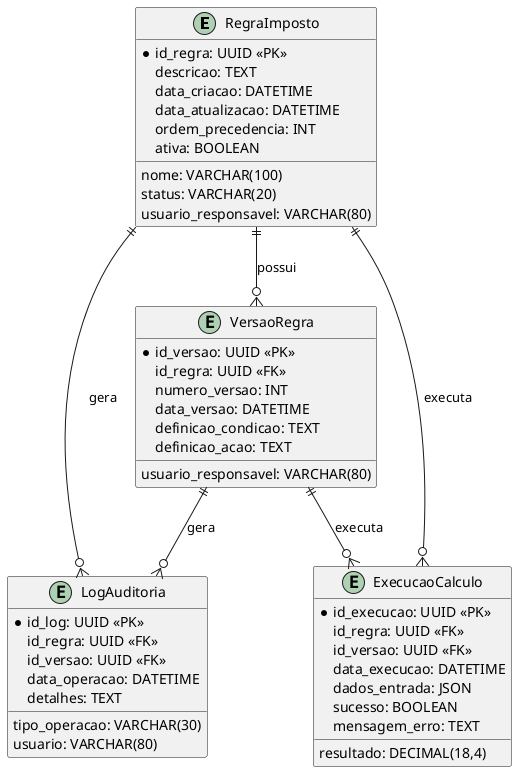
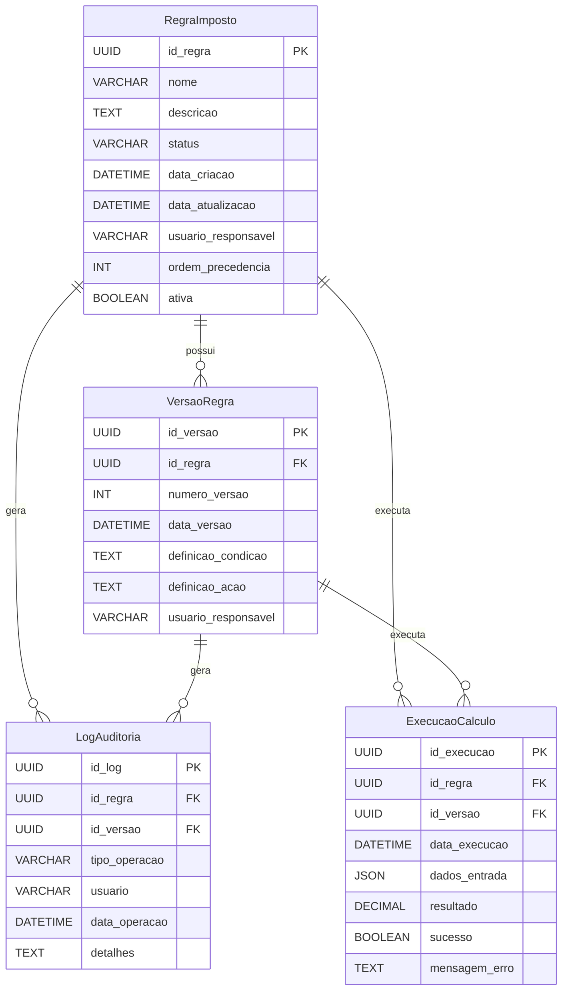

# 🗂️ Modelo Entidade-Relacionamento (MER)

## 📘 Entidades

### 🧩 Entidade: `RegraImposto`

| Atributo           | Tipo de Dado     | PK | FK | Obrigatório | Observações                                 |
|--------------------|------------------|----|----|-------------|---------------------------------------------|
| id_regra           | UUID             | ✅ |    | ✅          | Identificador único da regra                |
| nome               | VARCHAR(100)     |    |    | ✅          | Nome da regra                              |
| descricao          | TEXT             |    |    |             | Descrição detalhada da regra                |
| status             | VARCHAR(20)      |    |    | ✅          | Domínio: ["ativa", "inativa"]               |
| data_criacao       | DATETIME         |    |    | ✅          | Data/hora de criação                        |
| data_atualizacao   | DATETIME         |    |    |             | Data/hora da última atualização             |
| usuario_responsavel| VARCHAR(80)      |    |    | ✅          | Usuário responsável pela última alteração   |
| ordem_precedencia  | INT              |    |    |             | Ordem de execução das regras                |
| ativa              | BOOLEAN          |    |    | ✅          | Indica se a regra está ativa                |

---

### 🧩 Entidade: `VersaoRegra`

| Atributo           | Tipo de Dado     | PK | FK | Obrigatório | Observações                                 |
|--------------------|------------------|----|----|-------------|---------------------------------------------|
| id_versao          | UUID             | ✅ |    | ✅          | Identificador único da versão               |
| id_regra           | UUID             |    | ✅ | ✅          | FK para RegraImposto                        |
| numero_versao      | INT              |    |    | ✅          | Número sequencial da versão                 |
| data_versao        | DATETIME         |    |    | ✅          | Data/hora da versão                         |
| definicao_condicao | TEXT             |    |    | ✅          | Expressão lógica das condições              |
| definicao_acao     | TEXT             |    |    | ✅          | Expressão aritmética da ação de cálculo     |
| usuario_responsavel| VARCHAR(80)      |    |    | ✅          | Usuário responsável pela versão             |

---

### 🧩 Entidade: `LogAuditoria`

| Atributo           | Tipo de Dado     | PK | FK | Obrigatório | Observações                                 |
|--------------------|------------------|----|----|-------------|---------------------------------------------|
| id_log             | UUID             | ✅ |    | ✅          | Identificador único do log                  |
| id_regra           | UUID             |    | ✅ |            | FK para RegraImposto (pode ser nulo)        |
| id_versao          | UUID             |    | ✅ |            | FK para VersaoRegra (pode ser nulo)         |
| tipo_operacao      | VARCHAR(30)      |    |    | ✅          | Domínio: ["criação", "edição", "ativação", "desativação", "execução"] |
| usuario            | VARCHAR(80)      |    |    | ✅          | Usuário responsável pela operação           |
| data_operacao      | DATETIME         |    |    | ✅          | Data/hora da operação                       |
| detalhes           | TEXT             |    |    |             | Detalhes adicionais da operação             |

---

### 🧩 Entidade: `ExecucaoCalculo`

| Atributo           | Tipo de Dado     | PK | FK | Obrigatório | Observações                                 |
|--------------------|------------------|----|----|-------------|---------------------------------------------|
| id_execucao        | UUID             | ✅ |    | ✅          | Identificador único da execução             |
| id_regra           | UUID             |    | ✅ | ✅          | FK para RegraImposto                        |
| id_versao          | UUID             |    | ✅ | ✅          | FK para VersaoRegra                         |
| data_execucao      | DATETIME         |    |    | ✅          | Data/hora da execução                       |
| dados_entrada      | JSON             |    |    | ✅          | Dados de entrada fornecidos                 |
| resultado          | DECIMAL(18,4)    |    |    | ✅          | Valor do imposto calculado                  |
| sucesso            | BOOLEAN          |    |    | ✅          | Indica se a execução foi bem-sucedida       |
| mensagem_erro      | TEXT             |    |    |             | Mensagem de erro, se houver                 |

---

## 🔗 Relacionamentos

| Relacionamento                                                        | Tipo (Cardinalidade) | Atributos Associativos | Observações                                                        |
|-----------------------------------------------------------------------|----------------------|-----------------------|--------------------------------------------------------------------|
| `RegraImposto` se relaciona com `VersaoRegra` via `id_regra`          | 1:N                  | —                     | Uma regra pode ter várias versões                                  |
| `RegraImposto` se relaciona com `LogAuditoria` via `id_regra`         | 1:N                  | —                     | Uma regra pode ter vários logs de auditoria                        |
| `VersaoRegra` se relaciona com `LogAuditoria` via `id_versao`         | 1:N                  | —                     | Uma versão pode ter vários logs de auditoria                       |
| `RegraImposto` se relaciona com `ExecucaoCalculo` via `id_regra`      | 1:N                  | —                     | Uma regra pode ter várias execuções de cálculo                     |
| `VersaoRegra` se relaciona com `ExecucaoCalculo` via `id_versao`      | 1:N                  | —                     | Uma versão pode ter várias execuções de cálculo                    |

---

## 📎 Legenda

- **PK:** Chave Primária  
- **FK:** Chave Estrangeira  
- **Tipo de Dado:** Exemplos: INT, VARCHAR(n), DATE, BOOLEAN, UUID  
- **Obrigatório:** Campo obrigatório (`NOT NULL`)  
- **Tipo (Cardinalidade):** 1:1, 1:N, N:N  

---

## 📝 Observações Gerais

- Toda entidade possui chave primária única (PK).
- O versionamento das regras é feito pela entidade `VersaoRegra`.
- O log de auditoria pode estar associado a uma regra e/ou a uma versão.
- Execuções de cálculo são rastreadas para auditoria e análise.

---

# DER (Diagrama Entidade-Relacionamento) – PlantUML

---

# DER (Diagrama Entidade-Relacionamento) – Mermaid.js

Se precisar de ajustes ou detalhamento de atributos, posso refinar conforme o contexto do projeto!